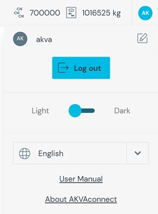

#Startup and login

The- site manager creates user and gives user access at a basic or advanced level. Login information is provided by the site manager. The site manager receives access and login information from AKVA engineer. The AKVAconnect address is provided by AKVA engineer. Log in by entering the given username and password. By clicking Remember Me, logging in is simplified next time by using Quick Log In at the bottom of the page (Note: Can’t be used by the location manager).

A user dropdown can be shown by clicking on the user icon (AK) in the upper right corner. It contains log out and language selection. In the upper right corner of the user drop-down, a pencil can be clicked to change the user’s information and password. The user can change the applications color between light and dark theme by switching the toggle from ”light” to ”dark”. The user icon (BA) based on the user initiales. The user can reach the version information under ”About AKVAconnect”.

The user can open a new tab by click on the ”plus’’ sign on the lower navigation bar.

To secure that this tab remains open when closing and reopening a browser the user can use the padlock on the left side on each tab. The padlock locked and unlocked by being clicked on.

